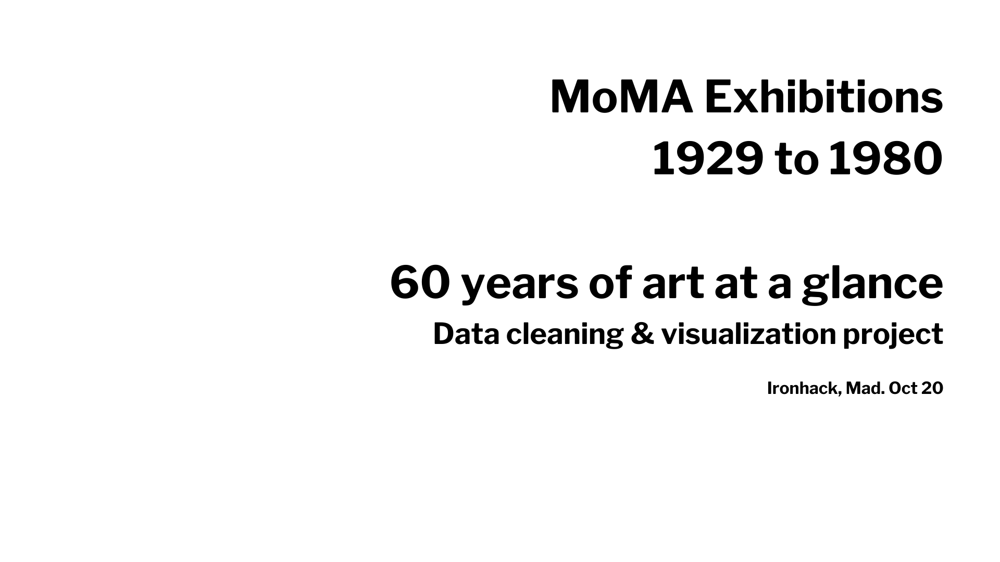

Este proyecto consiste en la limpieza, análisis y visualización y de datos de un dataset del Museum of Modern Art (MoMA) proporcionado por la entidad en su cuenta de GitHub.

Este conjunto de datos de investigación enumera 1.788 exposiciones. Representan todas las muestras conocidas realizadas en el museo desde 1929 hasta 1989.

## Bibliotecas 

Plotly  
Matplotlib  
Seaborn  
Pandas  
Numpy 

## Fuentes 

https://pandas.pydata.org/  
https://plotly.com/  
https://matplotlib.org/  
https://towardsdatascience.com/  
https://github.com/  
https://stackoverflow.com/  
https://medium.com/  
https://github.com/MuseumofModernArt/exhibitions  
https://www.moma.org/  
https://www.geeksforgeeks.org/  
https://python-graph-gallery.com/
